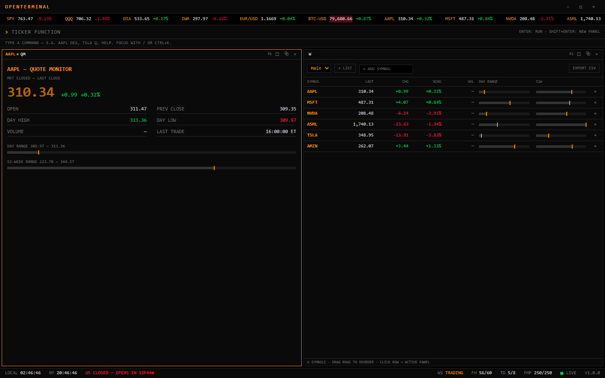
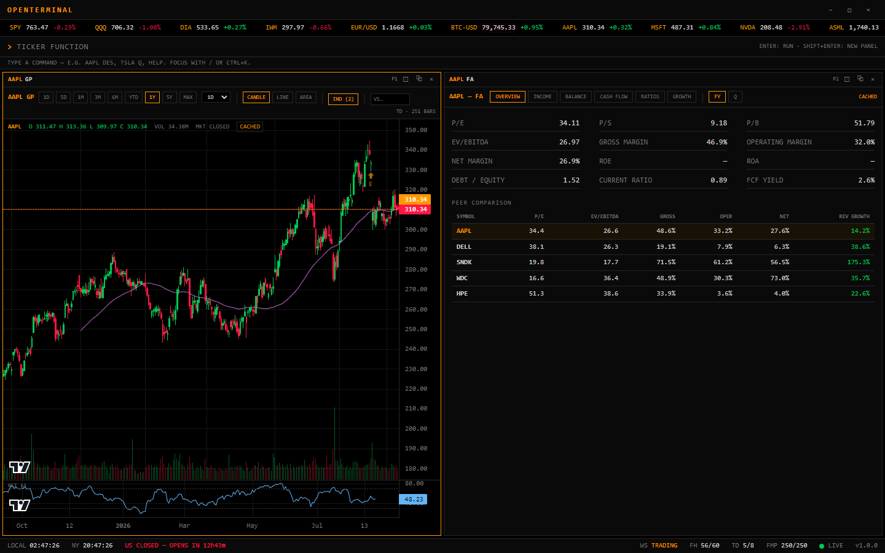

# OpenTerminal

A keyboard-first, multi-panel, Bloomberg-style market terminal as a native desktop app — Electron + React + TypeScript, built entirely on free-tier market data APIs.




## Features

- **Live market data** — Finnhub WebSocket relay (reference-counted, timer-coalesced batches, auto-reconnect with backoff), live ticker tape, quote monitor (`QM`), watchlists (`W`), world indices (`WEI`), movers (`MOST`)
- **Charting** (`GP`/`GIP`) — candles/line/area, 1D→MAX ranges, volume, SMA/EMA/Bollinger/VWAP overlays, synced RSI & MACD sub-panes, compare mode, live last-candle updates, earnings markers, per-panel persisted settings
- **Research** — company/market news with 60 s polling (`N`/`TOP`), full financial statements + ratios + peers (`FA`), earnings surprises (`ERN`), dividends (`DVD`), SEC EDGAR filings (`CACS`), historical price table (`HP`), economic calendar with impact/country filters (`ECAL`, keyless), live SEC Form 4 insider stream (`INSD`), keyless RSS news wire with lexicon sentiment and bull/bear meter (`WIRE`)
- **Analysis & tools** — screener with saved screens (`EQS`), portfolios with live P&L and vs-SPY (`PORT`), alerts that fire natively while minimized to tray (`ALRT`), FRED macro dashboard (`ECO`), yield curve (`GC`), sector heatmap (`HMAP`), FX & crypto dashboards (`FX`/`CRYP`), per-ticker notes (`MSG`), options chain (`OPT`, feature-flagged, Polygon)
- **World monitoring** — space dashboard with live ISS position on a built-in dark SVG world map, geomagnetic Kp, moon phase and upcoming launches (`SPACE`, keyless), live US airspace with business jets highlighted via OpenSky (`FLT`, keyless)
- **Workstation** — pop-out panels for multi-monitor (streaming and link groups span windows), named workspaces (`WS <name>`), universal CSV/JSON exports, panel PNG snapshots, per-rule alert sounds, auto-launch, tray mode

## Quick start

```bash
npm install
npm run dev        # opens the app with hot reload
```

On first launch the wizard asks for a **Finnhub** key, validates it, and stores it encrypted via OS `safeStorage` (on Linux without gnome-keyring/kwallet you are warned and must explicitly accept plaintext). Add more keys any time in `SET`:

| Provider | Used for | Register |
|---|---|---|
| Finnhub (required) | streaming, quotes, profiles, news, earnings | finnhub.io |
| Twelve Data | candles, international indices, FX | twelvedata.com |
| FMP | statements, screener, movers | financialmodelingprep.com |
| FRED | macro dashboard, yield curve | fred.stlouisfed.org |
| Alpaca (optional) | quote fallback, bid/ask, extended-hours bars — paste as `KEY_ID:SECRET` | alpaca.markets |
| Marketaux (optional) | news fallback with sentiment | marketaux.com |
| CoinGecko (optional) | crypto (works keyless; demo key raises limits) | coingecko.com |
| Polygon (optional) | `OPT` options chain (paid options plan) | polygon.io |

For development you can copy `.env.example` to `.env` — guarded by `!app.isPackaged`, packaged builds never read it.

**Commands**: `AAPL GP`, `AAPL FA`, `W`, `EQS BIGTECH`, `WS TRADING`… — focus with `/` or `Ctrl+K`, `Shift+Enter` opens in a new panel, `Tab`/`Ctrl+1..6` navigate, `Ctrl+Shift+P` pops the active panel out, `Ctrl+Shift+S` snapshots it. `HELP` lists everything (same registry as the autocomplete).

## Architecture

```
┌─────────────────────────────────────────────────────────────┐
│ MAIN (Node)                                                 │
│  keys.ts          safeStorage-encrypted API keys            │
│  providers/       Finnhub · TwelveData · FMP · FRED ·       │
│                   Alpaca · Marketaux · CoinGecko · Polygon  │
│                   → ProviderRouter, token buckets,          │
│                     TTL + disk caches                       │
│  stream/          WS relay: refcounted subs per window,     │
│                   150ms coalesced batches, backoff+jitter   │
│  alerts.ts        AlertEngine (fires from tray)             │
│  candles.ts       priority queue + disk cache               │
│  popouts.ts       pop-out windows (geometry in workspaces)  │
│  exportService.ts CSV(BOM)/JSON via native dialogs          │
│  updater.ts       electron-updater (disabled unsigned)      │
│  ipc.ts           zod-validated handlers, whitelisted       │
└──────────┬──────────────────────────────┬───────────────────┘
      contextBridge                  contextBridge
┌──────────┴───────────┐   ┌──────────────┴──────────────────┐
│ MAIN WINDOW          │   │ POP-OUTS (?popout=1)            │
│ tape · command line  │   │ same bundle + preload, one      │
│ panel grid · status  │   │ fixed panel, follows link group │
└──────────────────────┘   └─────────────────────────────────┘
```

The renderer makes **zero** third-party network requests; API keys never leave the main process. A symbol watched in five panels across two windows costs one upstream subscription.

## Building & packaging

```bash
npm run typecheck   # strict TS across main/preload/renderer
npm test            # indicator math (vitest)
npm run build       # production bundles
npm run dist        # installer for the CURRENT OS (NSIS / dmg / AppImage+deb)
```

Cross-OS builds should be done on their own OS (or CI matrix) — electron-builder cross-compilation is unreliable. Icons are generated from code: `node scripts/generate-icon.js`; alert sounds likewise: `node scripts/generate-sounds.js` (pure sine-wave beeps synthesized by the script — public domain, no third-party samples).

### Unsigned-build caveats

Releases built without code signing trigger OS warnings:

- **Windows SmartScreen**: "More info" → "Run anyway".
- **macOS Gatekeeper**: right-click the app → Open (once), or `xattr -d com.apple.quarantine /Applications/OpenTerminal.app`.
- **Linux**: AppImage runs unsigned; `chmod +x` it.

Auto-update is **disabled** in unsigned builds (and in dev) by design — meaningful auto-update requires Windows Authenticode / macOS notarization. Distributions without signing must ship with the updater disabled (the default; see `src/main/updater.ts`).

### Troubleshooting & diagnostics (v1.0.1)

- Logs rotate in `userData/logs` (5 × 2 MB, secrets redacted) — SET → About → "Open logs folder".
- SET → About → "Export diagnostics" produces the JSON to attach to a bug report (versions, provider status, bucket/cache stats, last 200 log lines — never API keys; tickers optional).
- Corrupt settings files are backed up as `<name>.corrupt-<timestamp>.json` and recreated automatically.
- CI (GitHub Actions) runs typecheck + the 55-test suite on every push, and builds unsigned Windows/macOS/Linux installers on `v*` tags.

### Security notes

- Renderer: `contextIsolation` + `sandbox`, whitelisted IPC only, CSP in `index.html`, no Node access.
- `npm audit`: zero criticals. Accepted (build/dev-time only, not shipped in the app): Electron ≤40 advisory chain (fixing requires a major-version jump; mitigated by sandbox/CSP/no remote content), `esbuild` dev-server advisory (vite 5 toolchain, dev only), `extract-zip` in electron download tooling (build machine only).

## Data attribution & disclaimer

Market data by **Finnhub**, **Twelve Data**, **Financial Modeling Prep**, **Alpaca**, **Marketaux** and **Polygon** under their respective terms. Crypto data by **CoinGecko** (coingecko.com). Macro data from **FRED®**, Federal Reserve Bank of St. Louis — this product uses the FRED API but is not endorsed or certified by the Federal Reserve Bank of St. Louis. SEC filings from **EDGAR** (sec.gov); EDGAR requests carry an operator-contact User-Agent — set YOUR e-mail in SET → Providers (CACS stays politely disabled until you do).

**Disclaimer**: market data may be delayed or incomplete. OpenTerminal is for personal and educational use; nothing in it is investment advice.

## License

MIT — see [LICENSE](LICENSE). See [CHANGELOG.md](CHANGELOG.md) for the phase-by-phase history and [ROADMAP.md](ROADMAP.md) for parked ideas.
